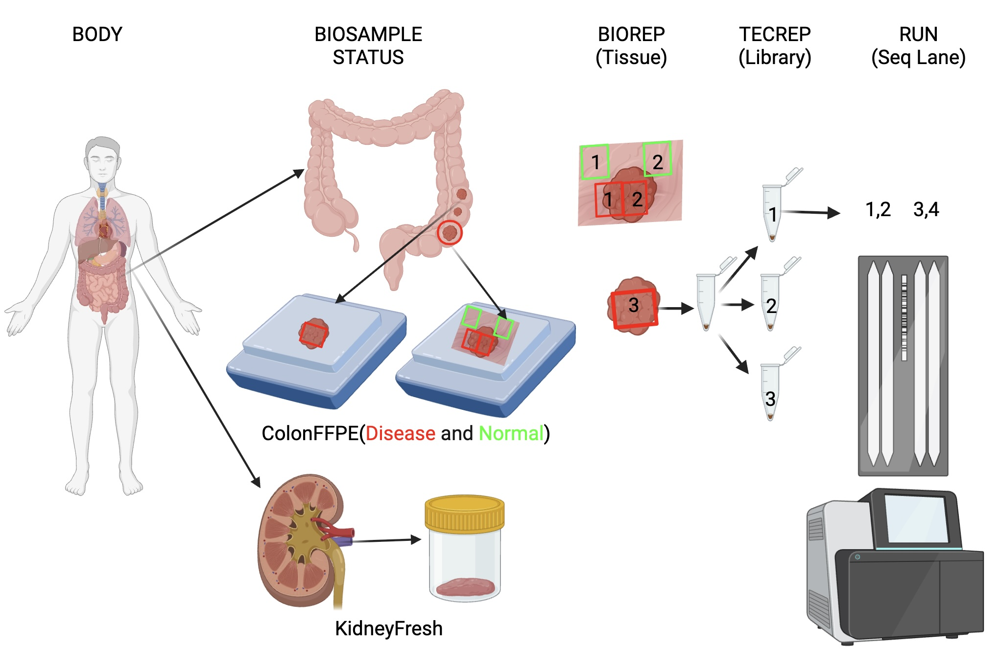

# Tutorial for running FFPE/Fresh CUTAC mutation calling pipeline 


This is FFPE/Fresh CUTAC pipeline implemented for FH's rhino clusters.

Rhino users only need to fill in he metadata table and configuration file to get mutation calling with one command line.


## Step-by-step 

1. Download the pipeline script

```
mkdir /path/to/your/script/directory
cd /path/to/your/script/directory
git clone
```

2. Fill in the metadata table

Please follow the instructions in the Excel file (CUTAC_pipeline_data_template.xlsx) to fill in the metadata table and save it as TXT file with the file name metadata.txt.
Please see the definition of the BODY/BIOSAMPLE/STATUS/BIOREP/TECREP/RUN in the figure below so that you can fill the metadata table correctly.

The pipeline will be applied to each triplet (BODY, BIOSAMPLE, STATUS), and the user will get one somatic mutation VCF calling result (all BIOREPs/TECREPs/RUNs for a (BODY, BIOSAMPLE, STATUS) will be used to call somatic mutation together.
If you want to call somatic mutation separately by BIOREPs, TECREPs or RUNs, please rename their BIOSAMPLE with different names (e.g. ColonFFPE: ColonFFPE1, ColonFFPE2, ColonFFPE3). In this way the pipeline will apply to each (BODY, BIOSAMPLE, STATUS) seperately.

Replace 00.settings/metadata.txt with your metadata.txt



Different BIOREPs with the same STATUS from a BIOSAMPLE will be merged into one Pipeline, and the user will get one mutation calling result (VCF file):

Merge all ColonFFPE tumor samples from the same patient:

| BODY       | BIOSAMPLE   | STATUS | BIOREP | TECREP | RUN | Pipeline |
|------------|-------------|--------|--------|--------|-----|----------|
| PATIENT01 | ColonFFPE   | N      | 1      | 1      | 1   | 1        |
| PATIENT01 | ColonFFPE   | N      | 2      | 1      | 1   | 1        |
| PATIENT01 | ColonFFPE   | D      | 1      | 1      | 1   | 2        |
| PATIENT01 | ColonFFPE   | D      | 2      | 1      | 1   | 2        |
| PATIENT01 | ColonFFPE   | D      | 3      | 1      | 1   | 2        |
| PATIENT01 | ColonFFPE   | D      | 3      | 1      | 2   | 2        |
| PATIENT01 | ColonFFPE   | D      | 3      | 1      | 3   | 2        |
| PATIENT01 | ColonFFPE   | D      | 3      | 1      | 4   | 2        |
| PATIENT01 | ColonFFPE   | D      | 3      | 2      | 1   | 2        |
| PATIENT01 | ColonFFPE   | D      | 3      | 3      | 1   | 2        |
| PATIENT01 | ColonFFPE   | D      | 1      | 4      | 1   | 2        |
| PATIENT01 | KidneyFresh | N      | 1      | 1      | 1   | 3        |
| PATIENT02 | ColonFFPE   | N      | 1      | 1      | 1   | 4        |
| PATIENT02 | ColonFFPE   | N      | 2      | 1      | 1   | 4        |
| PATIENT02 | ColonFFPE   | D      | 1      | 1      | 1   | 5        |
| PATIENT02 | ColonFFPE   | D      | 2      | 1      | 1   | 5        |

Process ColonFFPE tumor samples from the same patient by FFPE slices:

| BODY       | BIOSAMPLE   | STATUS | BIOREP | TECREP | RUN | Pipeline |
|------------|-------------|--------|--------|--------|-----|----------|
| PATIENT01 | ColonFFPE1 | N      | 1      | 1      | 1   | 1        |
| PATIENT01 | ColonFFPE1 | N      | 2      | 1      | 1   | 1        |
| PATIENT01 | ColonFFPE1 | D      | 1      | 1      | 1   | 2        |
| PATIENT01 | ColonFFPE1 | D      | 2      | 1      | 1   | 2        |
| PATIENT01 | ColonFFPE2 | D      | 1      | 1      | 1   | 3        |
| PATIENT01 | ColonFFPE2 | D      | 1      | 1      | 2   | 3        |
| PATIENT01 | ColonFFPE2 | D      | 1      | 1      | 3   | 3        |
| PATIENT01 | ColonFFPE2 | D      | 1      | 1      | 4   | 3        |
| PATIENT01 | ColonFFPE2 | D      | 1      | 2      | 1   | 3        |
| PATIENT01 | ColonFFPE2 | D      | 1      | 3      | 1   | 3        |
| PATIENT01 | ColonFFPE2 | D      | 1      | 4      | 1   | 3        |
| PATIENT01 | KidneyFresh | N      | 1      | 1      | 1   | 4        |
| PATIENT02 | ColonFFPE1 | N      | 1      | 1      | 1   | 5        |
| PATIENT02 | ColonFFPE1 | N      | 2      | 1      | 1   | 5        |
| PATIENT02 | ColonFFPE1 | D      | 1      | 1      | 1   | 6        |
| PATIENT02 | ColonFFPE1 | D      | 2      | 1      | 1   | 6        |


***CAUTION: do not use '_' and spaces in the name***

***CAUTION: 'Fresh' must occur in BIOSAMPLE name for fresh samples***


3. Fill in the configuration file

Edit 00.settings/config.txt 

```
/home/zwei/fast/data/sh/pipe/FFPE_CUTAC_Pipeline_test     # working directory (pipeline results)
/home/zwei/fast/data/sh/ready/CUTAC_7_tissue_paper  # origin data directory (fastq files)
/fh/fast/lin_x/golden/ref/hg38                                 # genome references directory
/fh/fast/lin_x/golden/software                             # dependent software binaries directory
36                                                  # CPU-cores
683                                                 # memory (GB)
```
4. Run pipeline

```
cd /path/to/your/script/directory/FFPE_CUTAC_Pipeline
bash script.sh
```

5. Result

All of the results will be stored in the working directory defined in the first line of 00.settings/config.txt 

| Folder                  | Annotation                                                                |
|-------------------------|---------------------------------------------------------------------------|
| 00.settings             | configuration and metatdata                                               |
| 01.SampleList           | sample ID files                                                           |
| 02.cutAdapter           | fastqc result and adapter removed fastq files                             |
| 03.mapping              | bwa mapping result (bam file)                                             |
| 04.addRG                | add reads group (bam file)                                                |
| 05.removedup            | remove duplicated read comes from sequencing error (bam file)             |
| 06.removealldup         | remove all duplicated read comes from sequencing error and PCR (bam file) |
| 07.callpeak             | macs2 call peak region (bed file)                                         |
| 08.mergeBamByStatus     | merge all bam with the same status  (bam file)                            |
| 09.removealldupByStatus | remove all duplicated read comes from sequencing error and PCR (bam file) |
| 10.callpeakByStatus     | macs2 call peak region (bed file)                                         |
| 14.genBedGraph          | the read coverage track (BedGraph file)                                   |
| 15.genBigWig            | the read coverage track (BigWiggle file)                                  |
| 16.genBedGraphByStatus  | the read coverage track (BedGraph file)                                   |
| 17.genBigWigStatus      | the read coverage track (BigWiggle file)                                  |
| 18.mergePeakByStatus    | merge peak region by single sample and by status (bed file)               |
| 19.calibration          | calibrate the sequencing quality in bam file (bam)                        |
| 20.mutect2TumorOnly     | mutect2 call somatic mutation (vcf file)                                  |
| 23.filterMutectCalls    | Mark the type of somatic mutation called by mutect2 (vcf file)            |
| 24.selectVariants       | Select somatic mutation called by mutect2 (vcf file)                      |


6. Rerun some steps

If you want to rerun some steps rather than the whole pipeline, just comment the steps that you do not want to run with # at the beginning.

For example, if you want to re-run `23.filterMutectCalls.sh 24.selectVariants` only:

```
#Open the file
vi steplist.txt
```

edit the file into:

```
#02.cutAdapter.sh        run
#03.mapping.sh   run
#04.addRG.sh     run
#05.removedup.sh run
#06.removealldup.sh      run
#07.callpeak.sh  run
#14.genBedGraph.sh       run
#15.genBigWig.sh run
#19.calibration.sh       run
#08.mergeBamByStatus.sh  status
#09.removealldupByStatus.sh status
#10.callpeakByStatus.sh  status
#16.genBedGraphByStatus.sh       status
#17.genBigWigByStatus.sh status
#18.mergePeakByStatus.sh status
#20.mutect2TumorOnly.sh  status
23.filterMutectCalls.sh status
24.selectVariants.sh    status

```

Rerun the pipeline with the same script:

```
bash script.sh
```


